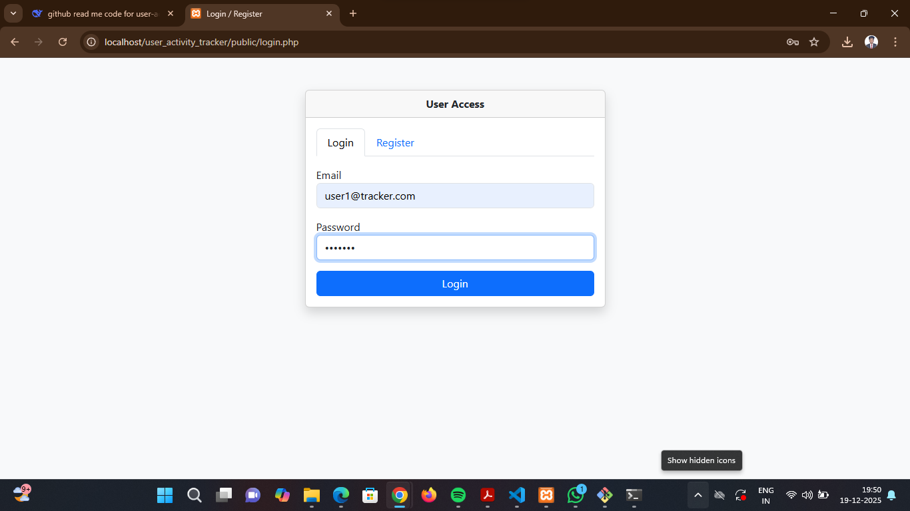
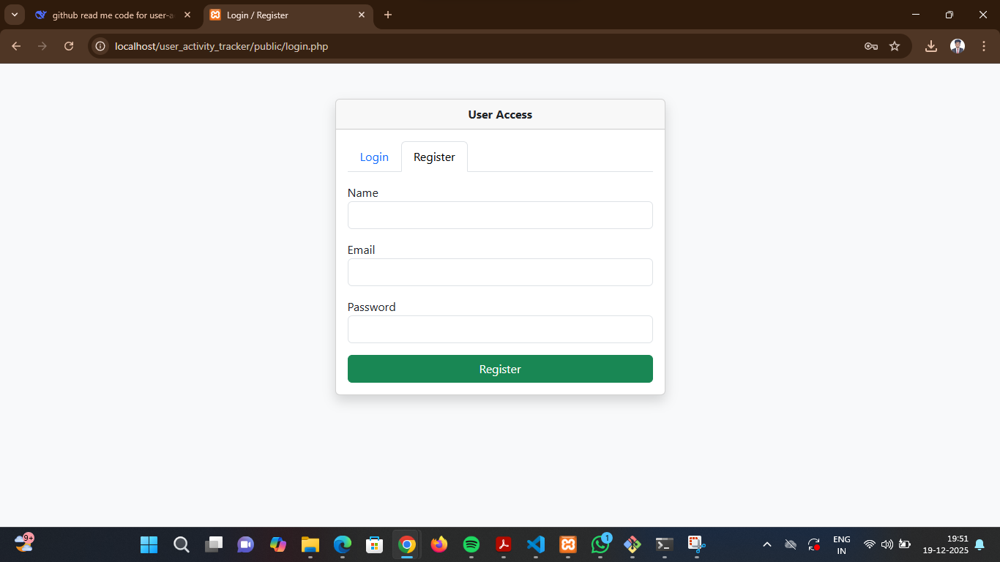
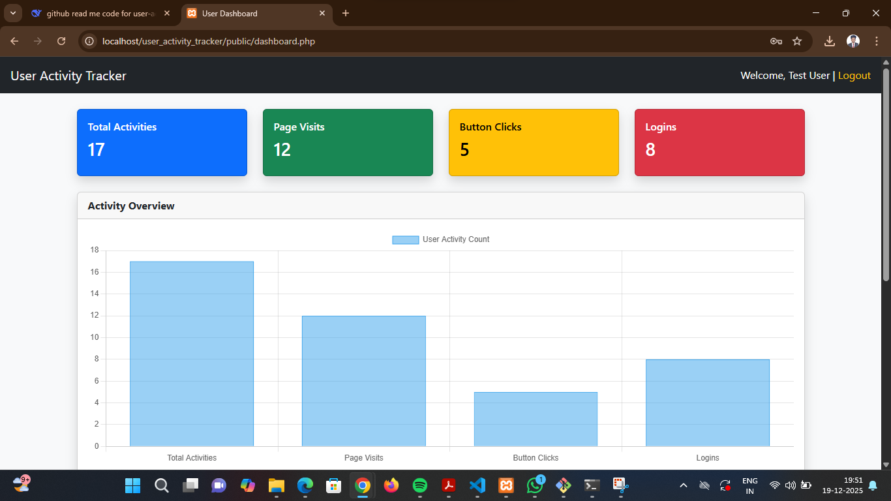
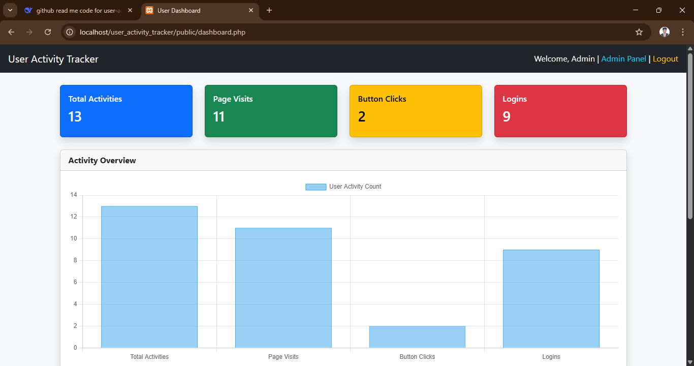
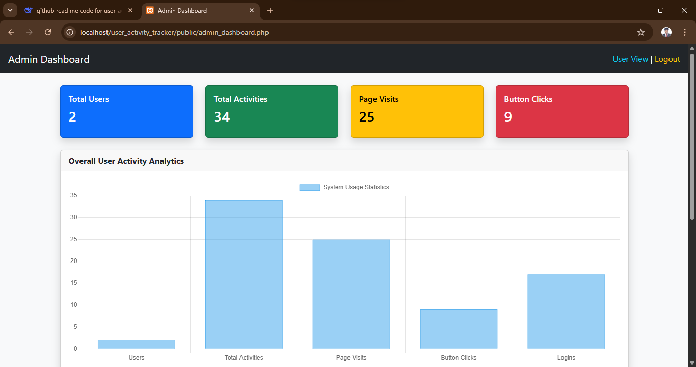
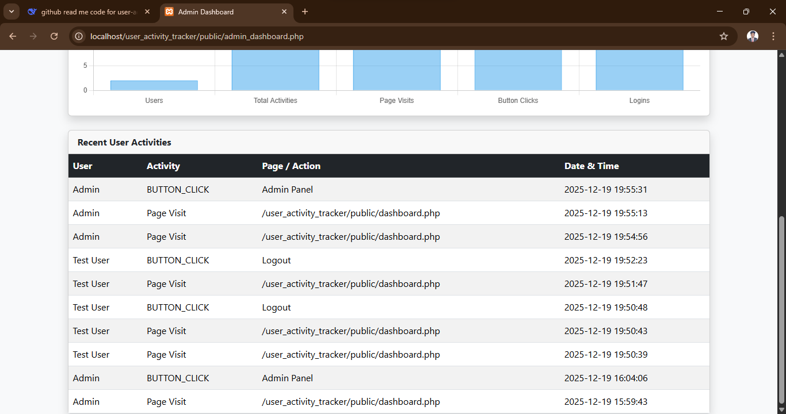

# 📊 User Activity Tracker System

A comprehensive user activity monitoring and analytics platform built with PHP, MySQL, and modern web technologies. This system provides real-time insights into user behavior, engagement metrics, and system usage patterns with beautiful visualizations.

## 🌟 Features

### 🎯 **User Activity Tracking**
- 📈 **Real-time Activity Monitoring** - Live tracking of user interactions
- 🖱️ **Button Click Analytics** - Track interaction with UI elements  
- 👁️ **Page Visit Tracking** - Monitor user navigation patterns
- 🔄 **Session Management** - Comprehensive login/logout tracking

### 👥 **User Management**
- 👤 **User Registration & Login** - Secure authentication system
- 🛡️ **Role-Based Access Control** - Separate User/Admin interfaces
- 📝 **Profile Management** - User information and activity history
- 🔐 **Secure Authentication** - Password hashing and session protection

### 📊 **Analytics & Reporting**
- 📉 **Interactive Charts** - Visual data representation with Chart.js
- 📋 **Activity Logs** - Detailed chronological activity records
- 📊 **Dashboard Analytics** - System-wide and user-specific metrics
- 📈 **Trend Analysis** - User engagement patterns over time

### 🎨 **User Experience**
- 📱 **Responsive Design** - Mobile-friendly Bootstrap 5 interface
- 🎯 **Intuitive Dashboard** - Clean, organized data presentation
- 🔄 **Real-time Updates** - Live statistics and activity feeds
- 🎪 **Visual Appeal** - Modern, professional UI design

## 🚀 Tech Stack

### **Backend**
- **PHP 8.0+** - Server-side scripting language
- **MySQL 8.0+** - Relational database management system  
- **PDO** - PHP Database Objects for secure database operations
- **Apache HTTP Server** - Web server with PHP support

### **Frontend**
- **HTML5** - Markup language for structure
- **CSS3** - Styling with modern features
- **JavaScript (ES6+)** - Client-side interactivity
- **Bootstrap 5** - Responsive UI framework
- **Chart.js** - Interactive data visualization library

### **Development Tools**
- **Git** - Version control system
- **Composer** - PHP dependency management
- **VS Code** - Code editor
- **phpMyAdmin** - Database administration tool

## 📸 Screenshots

### Login Page


### Register Page


### User Dashboard


### Admin Dashboard


### Admin Panel


### User Activities


## 🛠️ Setup Instructions

### **Prerequisites**
```bash
# Required Software
- PHP 8.0 or higher
- MySQL 8.0 or higher
- Apache HTTP Server (XAMPP/WAMP/MAMP recommended)
- Git
- Web Browser (Chrome/Edge/Firefox)
```

### Step 1: Clone the Repository
```bash
git clone https://github.com/yourusername/user-activity-tracker.git
cd user-activity-tracker
```
### Step 2: Database Setup
```bash
# Open MySQL Command Line or phpMyAdmin

# Create database
CREATE DATABASE activity_tracker;

# Use the database
USE activity_tracker;

# Import the SQL file (from phpMyAdmin or command line)
# For command line:
SOURCE /path/to/user-activity-tracker/database/activity_tracker.sql;

# Or in phpMyAdmin:
1. Select the 'activity_tracker' database
2. Click 'Import' tab
3. Choose activity_tracker.sql file
4. Click 'Go'
```
### Step 3: Configure Database Connection
```bash
# File: config/database.php
<?php
class Database {
    // Update these credentials as per your MySQL setup
    private $host = "localhost";      # MySQL host
    private $db_name = "activity_tracker"; # Database name
    private $username = "root";       # MySQL username
    private $password = "";           # MySQL password
    public $conn;

```
### Step 4: Enable PHP in Apache (XAMPP)
```bash
# 1. Open XAMPP Control Panel
# 2. Start Apache and MySQL services
# 3. Ensure PHP is enabled in Apache configuration

# 4. Copy project to htdocs folder:
C:\xampp\htdocs\user-activity-tracker\

# Or for WAMP:
C:\wamp\www\user-activity-tracker\

# Or for MAMP:
/Applications/MAMP/htdocs/user-activity-tracker/
```
### Step 5: Configure Project Structure
```bash
# Ensure proper file permissions (Linux/Mac)
chmod 755 -R user-activity-tracker/
chmod 644 config/database.php

# Create necessary directories
mkdir -p logs
mkdir -p uploads
chmod 777 logs/ uploads/
```
### Step 6: Run the Project
```bash
# 1. Start Apache and MySQL from your control panel

# 2. Open browser and navigate to:
http://localhost/user-activity-tracker/public/login.php

# Or if using built-in PHP server:
php -S localhost:8000 -t public/
# Then visit: http://localhost:8000/login.php
```

## 🔐 Default Login Credentials

Use the following credentials to log in to the application:

### 🐶 User Account
**Email:** user1@tracker.com  
**Password:** user123

### 👑 Admin Account
**Email:** admin@tracker.com  
**Password:** password

> ⚠️ *These credentials are for testing/demo purposes only. 
